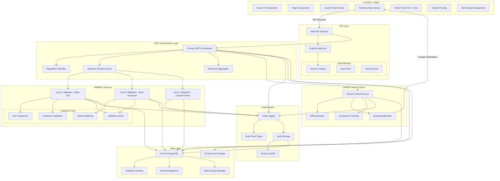
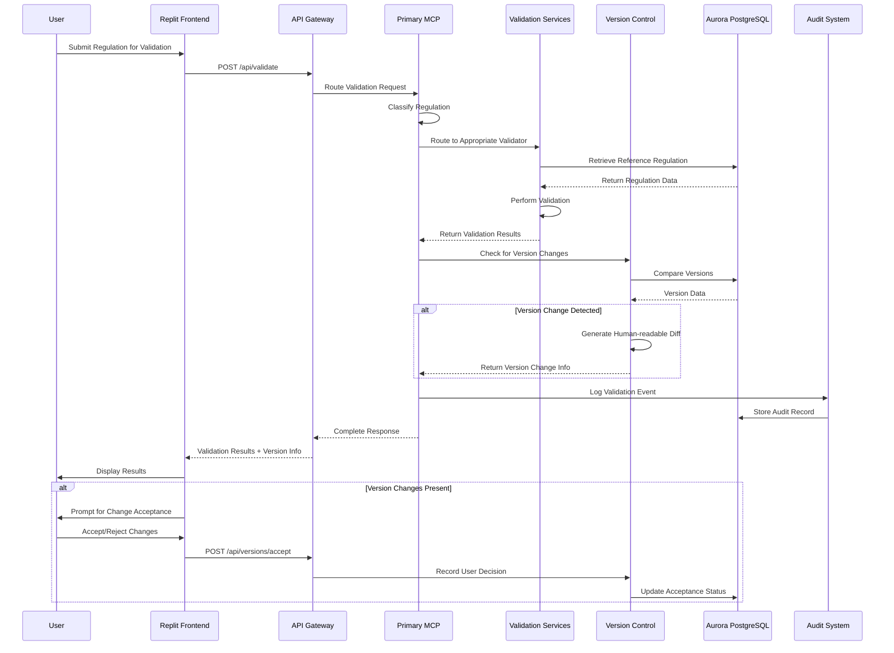
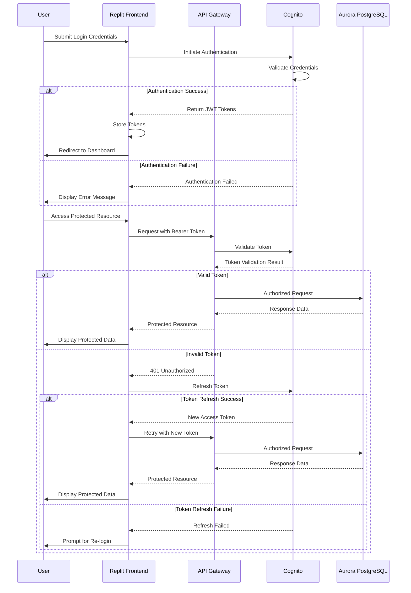

# EdSteward.ai Architecture Diagram

## System Flow Overview

## Authentication Flow

These diagrams provide a visual representation of the system architecture and key workflows in the EdSteward.ai MCP Platform.
